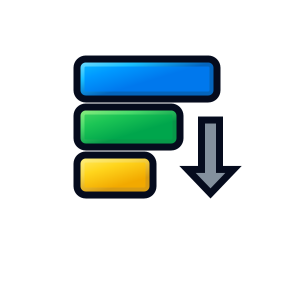
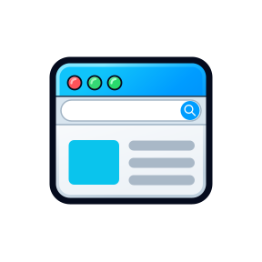
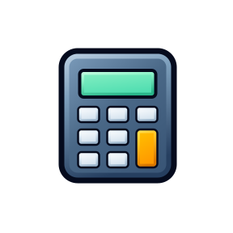
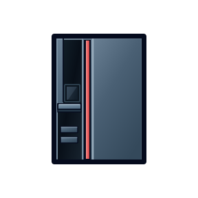
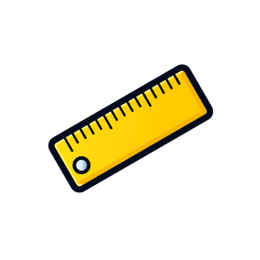
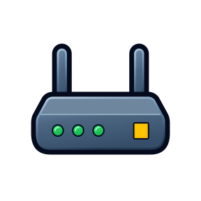
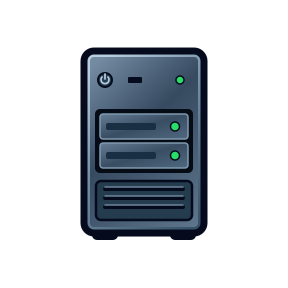
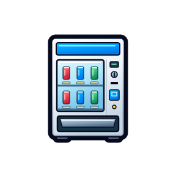

# aiclips

GPT-6 で作った SVG 形式のクリップアート集です。全 160 点を収録しています。

- サイズ：288 × 288 px

## クリップアート一覧

  
<strong>全160点のクリップアート</strong> 画像または日本語名をクリックすると、SVGファイルを開けます。

  <table align="center">
    <tbody>
      <tr>
        <td align="center" valign="middle" width="180">
          <a href="assets/svg/access-group.svg">
             
            <strong>グループ（権限管理）</strong>
          </a>
        </td>
        <td align="center" valign="middle" width="180">
          <a href="assets/svg/access-key.svg">
             
            <strong>鍵</strong>
          </a>
        </td>
        <td align="center" valign="middle" width="180">
          <a href="assets/svg/access-role.svg">
             
            <strong>ロール（権限管理）</strong>
          </a>
        </td>
        <td align="center" valign="middle" width="180">
          <a href="assets/svg/access-user.svg">
             
            <strong>ユーザー（権限管理）</strong>
          </a>
        </td>
      </tr>
      <tr>
        <td align="center" valign="middle" width="180">
          <a href="assets/svg/ai-agent.svg">
             
            <strong>AIエージェント</strong>
          </a>
        </td>
        <td align="center" valign="middle" width="180">
          <a href="assets/svg/ai.svg">
             
            <strong>人工知能（AI）</strong>
          </a>
        </td>
        <td align="center" valign="middle" width="180">
          <a href="assets/svg/airplane.svg">
             
            <strong>飛行機</strong>
          </a>
        </td>
        <td align="center" valign="middle" width="180">
          <a href="assets/svg/algorithm-logic.svg">
             
            <strong>ロジック</strong>
          </a>
        </td>
      </tr>
      <tr>
        <td align="center" valign="middle" width="180">
          <a href="assets/svg/algorithm-loop.svg">
             
            <strong>繰り返し</strong>
          </a>
        </td>
        <td align="center" valign="middle" width="180">
          <a href="assets/svg/algorithm-merge.svg">
             
            <strong>マージ</strong>
          </a>
        </td>
        <td align="center" valign="middle" width="180">
          <a href="assets/svg/algorithm-sort.svg">
             
            <strong>ソート</strong>
          </a>
        </td>
        <td align="center" valign="middle" width="180">
          <a href="assets/svg/ambulance.svg">
             
            <strong>救急車</strong>
          </a>
        </td>
      </tr>
      <tr>
        <td align="center" valign="middle" width="180">
          <a href="assets/svg/application-window.svg">
             
            <strong>アプリ画面</strong>
          </a>
        </td>
        <td align="center" valign="middle" width="180">
          <a href="assets/svg/approval-person.svg">
             
            <strong>承認者</strong>
          </a>
        </td>
        <td align="center" valign="middle" width="180">
          <a href="assets/svg/archive-box.svg">
             
            <strong>書類ボックス</strong>
          </a>
        </td>
        <td align="center" valign="middle" width="180">
          <a href="assets/svg/audio-speaker.svg">
             
            <strong>スピーカー</strong>
          </a>
        </td>
      </tr>
      <tr>
        <td align="center" valign="middle" width="180">
          <a href="assets/svg/balance-scale.svg">
             
            <strong>天秤</strong>
          </a>
        </td>
        <td align="center" valign="middle" width="180">
          <a href="assets/svg/barcode.svg">
             
            <strong>バーコード</strong>
          </a>
        </td>
        <td align="center" valign="middle" width="180">
          <a href="assets/svg/battery-module.svg">
             
            <strong>バッテリー</strong>
          </a>
        </td>
        <td align="center" valign="middle" width="180">
          <a href="assets/svg/bicycle.svg">
             
            <strong>自転車</strong>
          </a>
        </td>
      </tr>
      <tr>
        <td align="center" valign="middle" width="180">
          <a href="assets/svg/broadleaf-tree.svg">
             
            <strong>広葉樹</strong>
          </a>
        </td>
        <td align="center" valign="middle" width="180">
          <a href="assets/svg/browser-frame.svg">
             
            <strong>ブラウザー</strong>
          </a>
        </td>
        <td align="center" valign="middle" width="180">
          <a href="assets/svg/business-briefcase.svg">
             
            <strong>ブリーフケース</strong>
          </a>
        </td>
        <td align="center" valign="middle" width="180">
          <a href="assets/svg/business-building.svg">
             
            <strong>オフィス</strong>
          </a>
        </td>
      </tr>
      <tr>
        <td align="center" valign="middle" width="180">
          <a href="assets/svg/business-wallet.svg">
             
            <strong>財布</strong>
          </a>
        </td>
        <td align="center" valign="middle" width="180">
          <a href="assets/svg/calculator.svg">
             
            <strong>電卓</strong>
          </a>
        </td>
        <td align="center" valign="middle" width="180">
          <a href="assets/svg/calendar-board.svg">
             
            <strong>カレンダー</strong>
          </a>
        </td>
        <td align="center" valign="middle" width="180">
          <a href="assets/svg/call-center-agent.svg">
             
            <strong>コールセンター担当者</strong>
          </a>
        </td>
      </tr>
      <tr>
        <td align="center" valign="middle" width="180">
          <a href="assets/svg/cash-register.svg">
             
            <strong>レジ</strong>
          </a>
        </td>
        <td align="center" valign="middle" width="180">
          <a href="assets/svg/clipboard-sheet.svg">
             
            <strong>クリップボード</strong>
          </a>
        </td>
        <td align="center" valign="middle" width="180">
          <a href="assets/svg/clock.svg">
             
            <strong>時計</strong>
          </a>
        </td>
        <td align="center" valign="middle" width="180">
          <a href="assets/svg/closed-book.svg">
             
            <strong>閉じた本</strong>
          </a>
        </td>
      </tr>
      <tr>
        <td align="center" valign="middle" width="180">
          <a href="assets/svg/cloud-data-store.svg">
             
            <strong>クラウドデータストア</strong>
          </a>
        </td>
        <td align="center" valign="middle" width="180">
          <a href="assets/svg/cloud-service.svg">
             
            <strong>クラウドサービス</strong>
          </a>
        </td>
        <td align="center" valign="middle" width="180">
          <a href="assets/svg/coin.svg">
             
            <strong>硬貨</strong>
          </a>
        </td>
        <td align="center" valign="middle" width="180">
          <a href="assets/svg/company-president.svg">
             
            <strong>社長</strong>
          </a>
        </td>
      </tr>
      <tr>
        <td align="center" valign="middle" width="180">
          <a href="assets/svg/console-terminal.svg">
             
            <strong>ターミナル</strong>
          </a>
        </td>
        <td align="center" valign="middle" width="180">
          <a href="assets/svg/credit-card.svg">
             
            <strong>クレジットカード</strong>
          </a>
        </td>
        <td align="center" valign="middle" width="180">
          <a href="assets/svg/data-chart.svg">
             
            <strong>グラフ</strong>
          </a>
        </td>
        <td align="center" valign="middle" width="180">
          <a href="assets/svg/data-download.svg">
             
            <strong>ダウンロード</strong>
          </a>
        </td>
      </tr>
      <tr>
        <td align="center" valign="middle" width="180">
          <a href="assets/svg/data-upload.svg">
             
            <strong>アップロード</strong>
          </a>
        </td>
        <td align="center" valign="middle" width="180">
          <a href="assets/svg/database-cylinder.svg">
             
            <strong>データベース</strong>
          </a>
        </td>
        <td align="center" valign="middle" width="180">
          <a href="assets/svg/decision-manager.svg">
             
            <strong>上司</strong>
          </a>
        </td>
        <td align="center" valign="middle" width="180">
          <a href="assets/svg/delivery-van.svg">
             
            <strong>配送車</strong>
          </a>
        </td>
      </tr>
      <tr>
        <td align="center" valign="middle" width="180">
          <a href="assets/svg/department.svg">
             
            <strong>部署・組織図</strong>
          </a>
        </td>
        <td align="center" valign="middle" width="180">
          <a href="assets/svg/desktop-microphone.svg">
             
            <strong>マイク</strong>
          </a>
        </td>
        <td align="center" valign="middle" width="180">
          <a href="assets/svg/desktop-printer.svg">
             
            <strong>プリンター</strong>
          </a>
        </td>
        <td align="center" valign="middle" width="180">
          <a href="assets/svg/document-envelope.svg">
             
            <strong>封筒</strong>
          </a>
        </td>
      </tr>
      <tr>
        <td align="center" valign="middle" width="180">
          <a href="assets/svg/document-handoff.svg">
             
            <strong>資料の受け渡し</strong>
          </a>
        </td>
        <td align="center" valign="middle" width="180">
          <a href="assets/svg/document-scanner.svg">
             
            <strong>スキャナー</strong>
          </a>
        </td>
        <td align="center" valign="middle" width="180">
          <a href="assets/svg/earth.svg">
             
            <strong>地球</strong>
          </a>
        </td>
        <td align="center" valign="middle" width="180">
          <a href="assets/svg/factory-building.svg">
             
            <strong>工場</strong>
          </a>
        </td>
      </tr>
      <tr>
        <td align="center" valign="middle" width="180">
          <a href="assets/svg/field-worker.svg">
             
            <strong>現場担当者</strong>
          </a>
        </td>
        <td align="center" valign="middle" width="180">
          <a href="assets/svg/file-archive.svg">
             
            <strong>圧縮ファイル</strong>
          </a>
        </td>
        <td align="center" valign="middle" width="180">
          <a href="assets/svg/file-audio.svg">
             
            <strong>音声ファイル</strong>
          </a>
        </td>
        <td align="center" valign="middle" width="180">
          <a href="assets/svg/file-binary.svg">
             
            <strong>バイナリファイル</strong>
          </a>
        </td>
      </tr>
      <tr>
        <td align="center" valign="middle" width="180">
          <a href="assets/svg/file-code.svg">
             
            <strong>ソースコード</strong>
          </a>
        </td>
        <td align="center" valign="middle" width="180">
          <a href="assets/svg/file-csv.svg">
             
            <strong>CSVファイル</strong>
          </a>
        </td>
        <td align="center" valign="middle" width="180">
          <a href="assets/svg/file-document.svg">
             
            <strong>文書ファイル</strong>
          </a>
        </td>
        <td align="center" valign="middle" width="180">
          <a href="assets/svg/file-image.svg">
             
            <strong>画像ファイル</strong>
          </a>
        </td>
      </tr>
      <tr>
        <td align="center" valign="middle" width="180">
          <a href="assets/svg/file-markdown.svg">
             
            <strong>マークダウンファイル</strong>
          </a>
        </td>
        <td align="center" valign="middle" width="180">
          <a href="assets/svg/file-pdf.svg">
             
            <strong>PDF文書</strong>
          </a>
        </td>
        <td align="center" valign="middle" width="180">
          <a href="assets/svg/file-presentation.svg">
             
            <strong>プレゼンテーション資料</strong>
          </a>
        </td>
        <td align="center" valign="middle" width="180">
          <a href="assets/svg/file-spreadsheet.svg">
             
            <strong>表計算ファイル</strong>
          </a>
        </td>
      </tr>
      <tr>
        <td align="center" valign="middle" width="180">
          <a href="assets/svg/file-structured-data.svg">
             
            <strong>構造化データ</strong>
          </a>
        </td>
        <td align="center" valign="middle" width="180">
          <a href="assets/svg/file-text.svg">
             
            <strong>テキストファイル</strong>
          </a>
        </td>
        <td align="center" valign="middle" width="180">
          <a href="assets/svg/file-video.svg">
             
            <strong>動画ファイル</strong>
          </a>
        </td>
        <td align="center" valign="middle" width="180">
          <a href="assets/svg/file-word.svg">
             
            <strong>ワード文書</strong>
          </a>
        </td>
      </tr>
      <tr>
        <td align="center" valign="middle" width="180">
          <a href="assets/svg/folder-open.svg">
             
            <strong>フォルダー</strong>
          </a>
        </td>
        <td align="center" valign="middle" width="180">
          <a href="assets/svg/form-screen.svg">
             
            <strong>フォーム画面</strong>
          </a>
        </td>
        <td align="center" valign="middle" width="180">
          <a href="assets/svg/game-controller.svg">
             
            <strong>ゲームコントローラ</strong>
          </a>
        </td>
        <td align="center" valign="middle" width="180">
          <a href="assets/svg/general-user.svg">
             
            <strong>一般利用者</strong>
          </a>
        </td>
      </tr>
      <tr>
        <td align="center" valign="middle" width="180">
          <a href="assets/svg/gpu.svg">
             
            <strong>GPU</strong>
          </a>
        </td>
        <td align="center" valign="middle" width="180">
          <a href="assets/svg/hacker.svg">
             
            <strong>ハッカー</strong>
          </a>
        </td>
        <td align="center" valign="middle" width="180">
          <a href="assets/svg/hand-trolley.svg">
             
            <strong>台車</strong>
          </a>
        </td>
        <td align="center" valign="middle" width="180">
          <a href="assets/svg/hard-disk.svg">
             
            <strong>ハードディスク</strong>
          </a>
        </td>
      </tr>
      <tr>
        <td align="center" valign="middle" width="180">
          <a href="assets/svg/heart.svg">
             
            <strong>ハート</strong>
          </a>
        </td>
        <td align="center" valign="middle" width="180">
          <a href="assets/svg/hospital-building.svg">
             
            <strong>病院</strong>
          </a>
        </td>
        <td align="center" valign="middle" width="180">
          <a href="assets/svg/host-computer.svg">
             
            <strong>ホストコンピュータ</strong>
          </a>
        </td>
        <td align="center" valign="middle" width="180">
          <a href="assets/svg/idea-bulb.svg">
             
            <strong>電球</strong>
          </a>
        </td>
      </tr>
      <tr>
        <td align="center" valign="middle" width="180">
          <a href="assets/svg/identity-badge.svg">
             
            <strong>IDカード</strong>
          </a>
        </td>
        <td align="center" valign="middle" width="180">
          <a href="assets/svg/industrial-robot-arm.svg">
             
            <strong>産業用アーム</strong>
          </a>
        </td>
        <td align="center" valign="middle" width="180">
          <a href="assets/svg/information-mark.svg">
             
            <strong>情報マーク</strong>
          </a>
        </td>
        <td align="center" valign="middle" width="180">
          <a href="assets/svg/inspection-magnifier.svg">
             
            <strong>検索・拡大鏡</strong>
          </a>
        </td>
      </tr>
      <tr>
        <td align="center" valign="middle" width="180">
          <a href="assets/svg/internet.svg">
             
            <strong>インターネット</strong>
          </a>
        </td>
        <td align="center" valign="middle" width="180">
          <a href="assets/svg/japan-map.svg">
             
            <strong>日本地図</strong>
          </a>
        </td>
        <td align="center" valign="middle" width="180">
          <a href="assets/svg/job-controller.svg">
             
            <strong>ジョブコントローラー</strong>
          </a>
        </td>
        <td align="center" valign="middle" width="180">
          <a href="assets/svg/key-ring.svg">
             
            <strong>鍵束</strong>
          </a>
        </td>
      </tr>
      <tr>
        <td align="center" valign="middle" width="180">
          <a href="assets/svg/laptop-open.svg">
             
            <strong>ノートPC</strong>
          </a>
        </td>
        <td align="center" valign="middle" width="180">
          <a href="assets/svg/library.svg">
             
            <strong>ライブラリ</strong>
          </a>
        </td>
        <td align="center" valign="middle" width="180">
          <a href="assets/svg/loaded-pallet.svg">
             
            <strong>パレット</strong>
          </a>
        </td>
        <td align="center" valign="middle" width="180">
          <a href="assets/svg/location-map.svg">
             
            <strong>折り畳み地図</strong>
          </a>
        </td>
      </tr>
      <tr>
        <td align="center" valign="middle" width="180">
          <a href="assets/svg/maintenance-toolkit.svg">
             
            <strong>工具箱</strong>
          </a>
        </td>
        <td align="center" valign="middle" width="180">
          <a href="assets/svg/maintenance-wrench.svg">
             
            <strong>レンチ</strong>
          </a>
        </td>
        <td align="center" valign="middle" width="180">
          <a href="assets/svg/measurement-ruler.svg">
             
            <strong>定規</strong>
          </a>
        </td>
        <td align="center" valign="middle" width="180">
          <a href="assets/svg/medical-doctor.svg">
             
            <strong>医師</strong>
          </a>
        </td>
      </tr>
      <tr>
        <td align="center" valign="middle" width="180">
          <a href="assets/svg/memory-module.svg">
             
            <strong>メモリ</strong>
          </a>
        </td>
        <td align="center" valign="middle" width="180">
          <a href="assets/svg/message-queue.svg">
             
            <strong>メッセージキュー</strong>
          </a>
        </td>
        <td align="center" valign="middle" width="180">
          <a href="assets/svg/microscope.svg">
             
            <strong>顕微鏡</strong>
          </a>
        </td>
        <td align="center" valign="middle" width="180">
          <a href="assets/svg/money-bag.svg">
             
            <strong>お金</strong>
          </a>
        </td>
      </tr>
      <tr>
        <td align="center" valign="middle" width="180">
          <a href="assets/svg/mountain.svg">
             
            <strong>緑豊かな二つの山</strong>
          </a>
        </td>
        <td align="center" valign="middle" width="180">
          <a href="assets/svg/navigation-compass.svg">
             
            <strong>コンパス</strong>
          </a>
        </td>
        <td align="center" valign="middle" width="180">
          <a href="assets/svg/network-firewall.svg">
             
            <strong>ファイアーウォール</strong>
          </a>
        </td>
        <td align="center" valign="middle" width="180">
          <a href="assets/svg/network-router.svg">
             
            <strong>ルーター</strong>
          </a>
        </td>
      </tr>
      <tr>
        <td align="center" valign="middle" width="180">
          <a href="assets/svg/neural-network.svg">
             
            <strong>ニューラルネット</strong>
          </a>
        </td>
        <td align="center" valign="middle" width="180">
          <a href="assets/svg/office-employee-female.svg">
             
            <strong>女性社員</strong>
          </a>
        </td>
        <td align="center" valign="middle" width="180">
          <a href="assets/svg/office-employee-male.svg">
             
            <strong>男性社員</strong>
          </a>
        </td>
        <td align="center" valign="middle" width="180">
          <a href="assets/svg/older-adult.svg">
             
            <strong>高齢者</strong>
          </a>
        </td>
      </tr>
      <tr>
        <td align="center" valign="middle" width="180">
          <a href="assets/svg/open-report.svg">
             
            <strong>開いた冊子</strong>
          </a>
        </td>
        <td align="center" valign="middle" width="180">
          <a href="assets/svg/padlock.svg">
             
            <strong>南京錠</strong>
          </a>
        </td>
        <td align="center" valign="middle" width="180">
          <a href="assets/svg/passenger-bus.svg">
             
            <strong>バス</strong>
          </a>
        </td>
        <td align="center" valign="middle" width="180">
          <a href="assets/svg/passenger-car.svg">
             
            <strong>自動車</strong>
          </a>
        </td>
      </tr>
      <tr>
        <td align="center" valign="middle" width="180">
          <a href="assets/svg/passenger-train.svg">
             
            <strong>電車</strong>
          </a>
        </td>
        <td align="center" valign="middle" width="180">
          <a href="assets/svg/person-editing.svg">
             
            <strong>入力する人</strong>
          </a>
        </td>
        <td align="center" valign="middle" width="180">
          <a href="assets/svg/photo-camera.svg">
             
            <strong>カメラ</strong>
          </a>
        </td>
        <td align="center" valign="middle" width="180">
          <a href="assets/svg/power-plant.svg">
             
            <strong>発電所</strong>
          </a>
        </td>
      </tr>
      <tr>
        <td align="center" valign="middle" width="180">
          <a href="assets/svg/prepared-meal.svg">
             
            <strong>料理</strong>
          </a>
        </td>
        <td align="center" valign="middle" width="180">
          <a href="assets/svg/processor-chip.svg">
             
            <strong>中央処理装置（CPU）</strong>
          </a>
        </td>
        <td align="center" valign="middle" width="180">
          <a href="assets/svg/prohibition.svg">
             
            <strong>禁止</strong>
          </a>
        </td>
        <td align="center" valign="middle" width="180">
          <a href="assets/svg/protective-helmet.svg">
             
            <strong>保護帽</strong>
          </a>
        </td>
      </tr>
      <tr>
        <td align="center" valign="middle" width="180">
          <a href="assets/svg/protective-shield.svg">
             
            <strong>保護シールド</strong>
          </a>
        </td>
        <td align="center" valign="middle" width="180">
          <a href="assets/svg/puzzle-piece.svg">
             
            <strong>パズル部品</strong>
          </a>
        </td>
        <td align="center" valign="middle" width="180">
          <a href="assets/svg/qr-code.svg">
             
            <strong>QRコード</strong>
          </a>
        </td>
        <td align="center" valign="middle" width="180">
          <a href="assets/svg/rdbms-table.svg">
             
            <strong>データベースのテーブル</strong>
          </a>
        </td>
      </tr>
      <tr>
        <td align="center" valign="middle" width="180">
          <a href="assets/svg/rdbms-view.svg">
             
            <strong>データベースのビュー</strong>
          </a>
        </td>
        <td align="center" valign="middle" width="180">
          <a href="assets/svg/remote-control.svg">
             
            <strong>リモコン</strong>
          </a>
        </td>
        <td align="center" valign="middle" width="180">
          <a href="assets/svg/report-sheet.svg">
             
            <strong>レポート</strong>
          </a>
        </td>
        <td align="center" valign="middle" width="180">
          <a href="assets/svg/robot.svg">
             
            <strong>ロボット</strong>
          </a>
        </td>
      </tr>
      <tr>
        <td align="center" valign="middle" width="180">
          <a href="assets/svg/scientist.svg">
             
            <strong>博士</strong>
          </a>
        </td>
        <td align="center" valign="middle" width="180">
          <a href="assets/svg/sea.svg">
             
            <strong>海</strong>
          </a>
        </td>
        <td align="center" valign="middle" width="180">
          <a href="assets/svg/secure-safe.svg">
             
            <strong>金庫</strong>
          </a>
        </td>
        <td align="center" valign="middle" width="180">
          <a href="assets/svg/seedling.svg">
             
            <strong>苗</strong>
          </a>
        </td>
      </tr>
      <tr>
        <td align="center" valign="middle" width="180">
          <a href="assets/svg/sensor-node.svg">
             
            <strong>センサー</strong>
          </a>
        </td>
        <td align="center" valign="middle" width="180">
          <a href="assets/svg/server-rack.svg">
             
            <strong>サーバーラック</strong>
          </a>
        </td>
        <td align="center" valign="middle" width="180">
          <a href="assets/svg/settings-gear.svg">
             
            <strong>歯車</strong>
          </a>
        </td>
        <td align="center" valign="middle" width="180">
          <a href="assets/svg/ship.svg">
             
            <strong>船</strong>
          </a>
        </td>
      </tr>
      <tr>
        <td align="center" valign="middle" width="180">
          <a href="assets/svg/shipping-carton.svg">
             
            <strong>梱包箱</strong>
          </a>
        </td>
        <td align="center" valign="middle" width="180">
          <a href="assets/svg/shopping-cart.svg">
             
            <strong>ショッピングカート</strong>
          </a>
        </td>
        <td align="center" valign="middle" width="180">
          <a href="assets/svg/short-message.svg">
             
            <strong>ショートメッセージ</strong>
          </a>
        </td>
        <td align="center" valign="middle" width="180">
          <a href="assets/svg/smartphone-upright.svg">
             
            <strong>スマートフォン</strong>
          </a>
        </td>
      </tr>
      <tr>
        <td align="center" valign="middle" width="180">
          <a href="assets/svg/sports.svg">
             
            <strong>スポーツ</strong>
          </a>
        </td>
        <td align="center" valign="middle" width="180">
          <a href="assets/svg/star.svg">
             
            <strong>星</strong>
          </a>
        </td>
        <td align="center" valign="middle" width="180">
          <a href="assets/svg/stopwatch.svg">
             
            <strong>ストップウォッチ</strong>
          </a>
        </td>
        <td align="center" valign="middle" width="180">
          <a href="assets/svg/storefront.svg">
             
            <strong>店舗</strong>
          </a>
        </td>
      </tr>
      <tr>
        <td align="center" valign="middle" width="180">
          <a href="assets/svg/tablet-stylus.svg">
             
            <strong>ペン付きタブレット</strong>
          </a>
        </td>
        <td align="center" valign="middle" width="180">
          <a href="assets/svg/target-board.svg">
             
            <strong>的</strong>
          </a>
        </td>
        <td align="center" valign="middle" width="180">
          <a href="assets/svg/team-meeting.svg">
             
            <strong>打ち合わせ</strong>
          </a>
        </td>
        <td align="center" valign="middle" width="180">
          <a href="assets/svg/telephone.svg">
             
            <strong>電話</strong>
          </a>
        </td>
      </tr>
      <tr>
        <td align="center" valign="middle" width="180">
          <a href="assets/svg/thinking-person.svg">
             
            <strong>考える人</strong>
          </a>
        </td>
        <td align="center" valign="middle" width="180">
          <a href="assets/svg/tower-server.svg">
             
            <strong>タワー型サーバー</strong>
          </a>
        </td>
        <td align="center" valign="middle" width="180">
          <a href="assets/svg/traffic-light.svg">
             
            <strong>信号</strong>
          </a>
        </td>
        <td align="center" valign="middle" width="180">
          <a href="assets/svg/vaccine.svg">
             
            <strong>ワクチン</strong>
          </a>
        </td>
      </tr>
      <tr>
        <td align="center" valign="middle" width="180">
          <a href="assets/svg/vending-machine.svg">
             
            <strong>自動販売機</strong>
          </a>
        </td>
        <td align="center" valign="middle" width="180">
          <a href="assets/svg/virus.svg">
             
            <strong>ウイルス</strong>
          </a>
        </td>
        <td align="center" valign="middle" width="180">
          <a href="assets/svg/walking-sneaker.svg">
             
            <strong>スニーカー</strong>
          </a>
        </td>
        <td align="center" valign="middle" width="180">
          <a href="assets/svg/warehouse-building.svg">
             
            <strong>倉庫</strong>
          </a>
        </td>
      </tr>
      <tr>
        <td align="center" valign="middle" width="180">
          <a href="assets/svg/warning-mark.svg">
             
            <strong>警告</strong>
          </a>
        </td>
        <td align="center" valign="middle" width="180">
          <a href="assets/svg/water-faucet.svg">
             
            <strong>蛇口</strong>
          </a>
        </td>
        <td align="center" valign="middle" width="180">
          <a href="assets/svg/word-of-mouth.svg">
             
            <strong>口コミ</strong>
          </a>
        </td>
        <td align="center" valign="middle" width="180">
          <a href="assets/svg/world-globe.svg">
             
            <strong>地球儀</strong>
          </a>
        </td>
      </tr>
    </tbody>
  </table>

